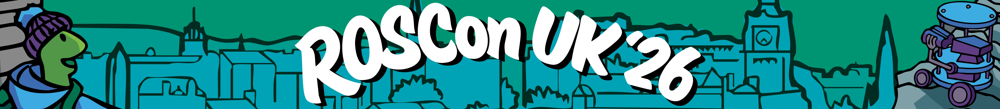
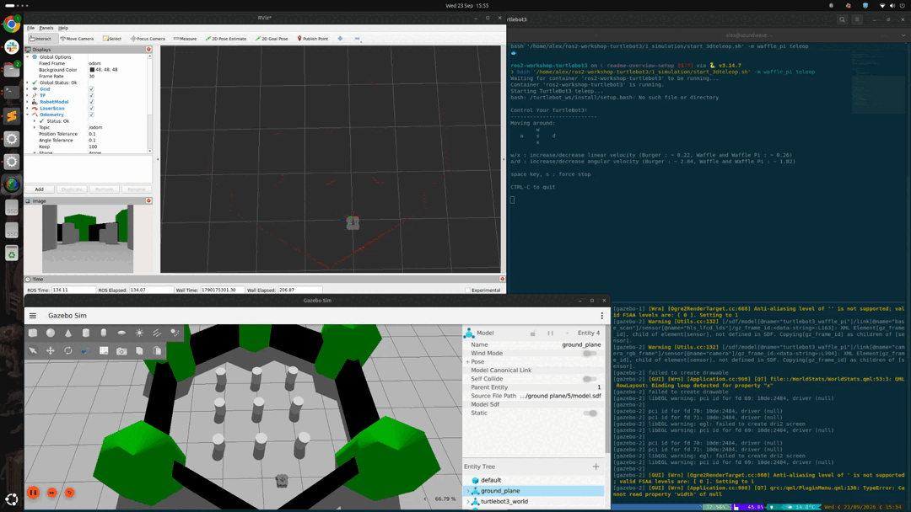

<!-- # ROS 101 Workshop - ROSCon UK 2026 -->


<!-- HEADER -->
<div align="center">
  <h2 align="center">ROS 101 Crash Course Workshop - ROSCon UK 2026</h2>

  <a>
    
  </a>

  <br />

  <!-- <h2 align="center">ROS 101 Crash Course - What's this all about?</h2> -->

  <p align="center">
    Tartan Robotics Collective
    <br />
    Centre for AI in Assistive Autonomy, School of Informatics
    <br />
    The University of Edinburgh, United Kingdom
  </p>
</div>

<!-- TABLE OF CONTENTS -->
<!-- <details> -->
  <summary>Overview and Setup</summary>
  <ul>
    <li>
      <a href="#about">About</a>
      <ul>
        <li><a href="#workshop-overview">Workshop Overview</a></li>
        <li><a href="#setup-instructions-(start-here)">Setup Instructions (Start Here)</a></li>
      </ul>
    </li>
  </ul>
<!-- </details> -->

<!-- <details> -->
  <summary>Tutorials</summary>
  <ol start="0">
    <li><a href="#0-introduction">Introduction</a></li>
    <li><a href="#1-simulation">Simulation</a></li>
    <li><a href="#2-apriltag-simulation">Apriltag Simulation</a></li>
    <li><a href="#3-real-robot">Real Turtlebot</a></li>
  </ol>
<!-- </details> -->

<!-- ABOUT THE PROJECT -->
## About

### Workshop Overview

We are excited to welcome you to our hands-on workshop at ROSCon UK 2026, where we will explore TODO

By the end of the workshop, you will:

- TODO

We encourage you to actively participate, ask questions, and share your own insights. The workshop is also a space for discussion on how we can collectively improve and standardise simulation and control practices in ROS 2. 

### Requirements

- Ubuntu laptop
- Docker
- Tmux

We use [Docker](https://www.docker.com/) and [Tmux](https://tmux.app/) to provide this workshop.

We provide convenient setup scripts for your convenience.
[Docker setup](https://github.com/tartanroboticscollective/ros2-workshop-turtlebot3/wiki/DockerSetup)
[Tmux setup](https://github.com/tartanroboticscollective/ros2-workshop-turtlebot3/wiki/TmuxSetup)

### Setup Instructions (Start Here)

The repository contains all the TODO that will be used during the workshop. Having it installed in advance will ensure you can follow each step, replicate demonstrations, and continue experimenting after the session.

## Exercises

### 0: Introduction

[Introduction to ROS2](https://github.com/tartanroboticscollective/ros2-workshop-turtlebot3/wiki/Introduction)

### 1: Simulation

[Simulation Tutorial](https://github.com/tartanroboticscollective/ros2-workshop-turtlebot3/wiki/Simulation)



### 2: Apriltag Simulation

[Apriltag Simulation Tutorial](https://github.com/tartanroboticscollective/ros2-workshop-turtlebot3/wiki/AprilTag%E2%80%90Simulation)

### 3: Real Turtlebot

[Real Turtlebot Tutorial](https://github.com/tartanroboticscollective/ros2-workshop-turtlebot3/wiki/RealTurtlebot)

### Simulated Turtlebot

Run `./2_apriltagsim/dev_session.sh`

type `export TURTLEBOT3_MODEL=burger_cam`

type `rbuild`

type `rsource`

type `ros2 launch apriltag-sim apriltag_world.launch.xml`


---
## FAQ

In order to be able to run **graphical user interfaces** from inside the Docker you might have to type

```bash
$ xhost +
```
