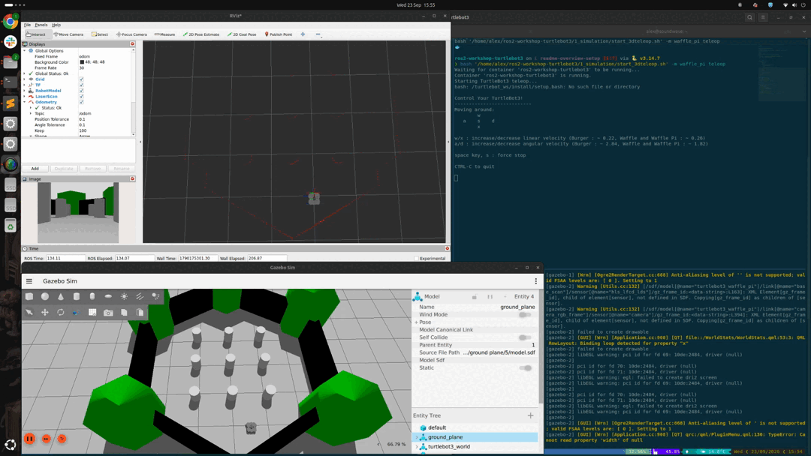
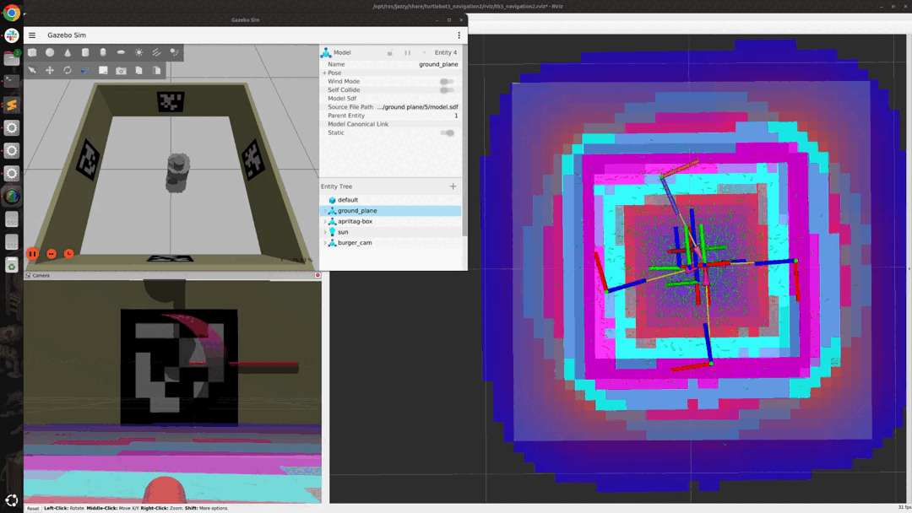
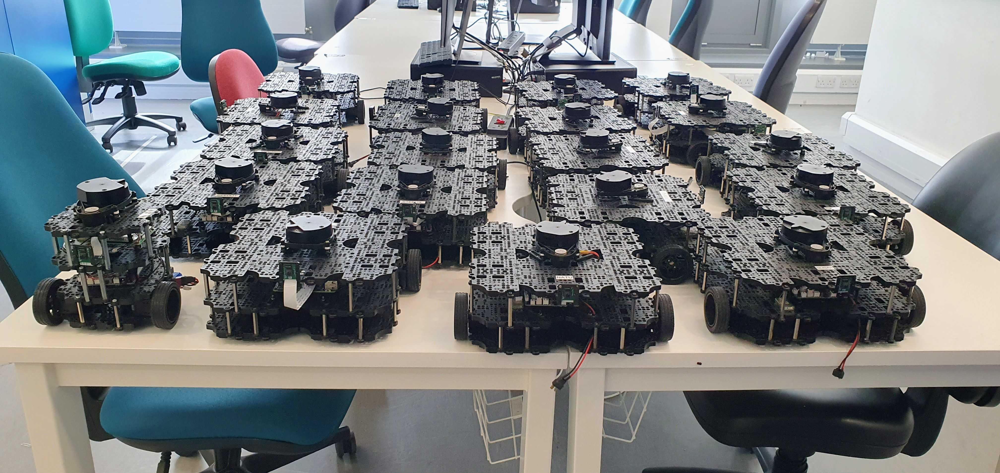

<!-- # ROS 101 Workshop - ROSCon UK 2026 -->


<!-- HEADER -->
<div align="center">

  <h2 align="center">ROS 101 Crash Course - What's this all about?</h2>

  <a>
    
  </a>

  <br />

</div>

<!-- TABLE OF CONTENTS -->
<!-- <details> -->
  <summary><strong>Overview and Setup</strong></summary>
  <ul>
    <li>
      <a href="#about">About</a>
      <ul>
        <li><a href="#workshop-overview">Workshop Overview</a></li>
        <li><a href="#setup-instructions-(start-here)">Setup Instructions (Start Here)</a></li>
      </ul>
    </li>
  </ul>
<!-- </details> -->

<!-- <details> -->
  <summary>Tutorials</summary>
  <ol start="0">
    <li><a href="#0-introduction">Introduction</a></li>
    <li><a href="#1-simulation">Simulation</a></li>
    <li><a href="#2-apriltag-simulation">Apriltag Simulation</a></li>
    <li><a href="#3-real-robot">Real Turtlebot</a></li>
  </ol>
<!-- </details> -->

<!-- ABOUT THE PROJECT -->
## About

### Workshop Overview

We are excited to welcome you to our hands-on workshop at ROSCon UK 2026, where we will explore:

#### 🐢 ROS fundamentals with Turtlesim
Get comfortable with the core concepts behind ROS nodes, topics, messages, services, commands and more.
#### 🗺️ TurtleBot3 simulation, SLAM & navigation
Move into simulation and learn how a mobile robot can map its environment and navigate autonomously.
#### 🤖 Deploy to a real TurtleBot3 Burger
Take what we’ve built in simulation and bring it into the real world.
#### 📷 Camera + AprilTag search
Put everything together by using the TurtleBot3’s camera to search for and detect AprilTags.


We encourage you to actively participate, ask questions, and share your own insights. The workshop is also a space for discussion on how we can collectively improve and standardise simulation and control practices in ROS 2.

### Requirements

- Ubuntu laptop
- Docker
- Tmux

We use [Docker](https://www.docker.com/) and [Tmux](https://tmux.app/) to provide this workshop.

We provide convenient setup scripts for your convenience.
[Docker setup](https://github.com/tartanroboticscollective/ros2-workshop-turtlebot3/wiki/DockerSetup)
[Tmux setup](https://github.com/tartanroboticscollective/ros2-workshop-turtlebot3/wiki/TmuxSetup)

### Setup Instructions (Start Here)

The repository contains all the scripts that will be used during the workshop.

If you find difficult to install docker and tmux you can navigate under
`scripts` and you will find the following helpers:

Run:

- `./get-docker.sh` to install docker on your system and remember to reboot! (ps: you will be asked to automatically reboot :))

- `./install_tmux.sh` to install tmux on your machine.
  - to finish setup tmux please copy or move the file `tmux.conf` under the Home directory with `cp tmux.conf ~/.tmux.conf`

Having it installed in advance will ensure you can follow each step, replicate demonstrations, and continue experimenting after the session.

## Exercises

### 0: Introduction

[Introduction to ROS2](https://github.com/tartanroboticscollective/ros2-workshop-turtlebot3/wiki/Introduction)

### 1: Simulation

[Simulation Tutorial](https://github.com/tartanroboticscollective/ros2-workshop-turtlebot3/wiki/Simulation)



### 2: Apriltag Simulation

[Apriltag Simulation Tutorial](https://github.com/tartanroboticscollective/ros2-workshop-turtlebot3/wiki/AprilTag%E2%80%90Simulation)



### 3: Real Turtlebot

[Real Turtlebot Tutorial](https://github.com/tartanroboticscollective/ros2-workshop-turtlebot3/wiki/RealTurtlebot)



---
## FAQ

In order to be able to run **graphical user interfaces** from inside the Docker you might have to type

```bash
$ xhost +
```

---
<!-- FOOTER -->
<div align="center">
  <a>
    
  </a>

  <br />

  <!-- <h2 align="center">ROS 101 Crash Course - What's this all about?</h2> -->

  <p align="center">
    Tartan Robotics Collective
    <br />
    Centre for AI in Assistive Autonomy, School of Informatics
    <br />
    The University of Edinburgh, United Kingdom
  </p>
</div>
