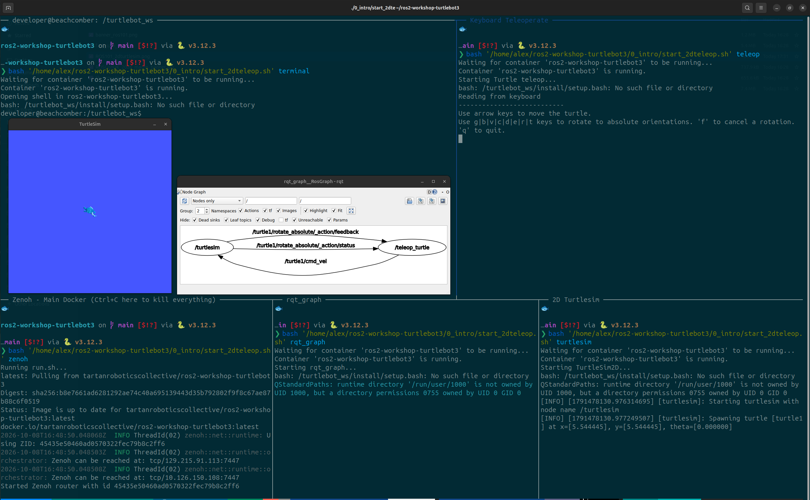
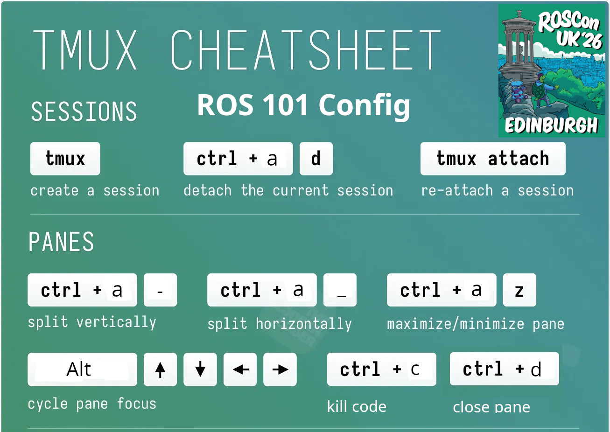

<!-- # ROS 101 Workshop - ROSCon UK 2026 -->


<!-- HEADER -->
<div align="center">

  <h2 align="center">ROS 101 Crash Course - What's this all about?</h2>

  <a>
    
  </a>

  <br />

</div>

<!-- TABLE OF CONTENTS -->
<!-- <details> -->
  <summary><strong>Overview and Setup</strong></summary>
  <ul>
    <li>
      <a href="#workshop-overview">Workshop Overview</a>
      <li><a href="#requirements">Requirements</a></li>
      <ul>
        <li><a href="#setup-instructions">Setup Instructions</a></li>
      </ul>
    </li>
  </ul>
<!-- </details> -->

<!-- <details> -->
  <summary>Tutorials</summary>
  <ol start="0">
    <li><a href="#0-introduction">Introduction</a></li>
    <li><a href="#1-simulation">Simulation</a></li>
    <li><a href="#2-apriltag-simulation">Apriltag Simulation</a></li>
    <li><a href="#3-real-robot">Real Turtlebot</a></li>
  </ol>
<!-- </details> -->

<!-- ABOUT THE PROJECT -->
## About

### Workshop Overview

We are excited to welcome you to our hands-on workshop at ROSCon UK 2026, where we will explore:

#### 🐢 ROS fundamentals with Turtlesim
Get comfortable with the core concepts behind ROS nodes, topics, messages, services, commands and more.
#### 🗺️ TurtleBot3 simulation, SLAM & navigation
Move into simulation and learn how a mobile robot can map its environment and navigate autonomously.
#### 🤖 Deploy to a real TurtleBot3 Burger or Waffle
Take what we’ve built in simulation and bring it into the real world.
#### 📷 Camera + AprilTag search
Put everything together by using the TurtleBot3’s camera to search for and detect AprilTags.


We encourage you to actively participate, ask questions, and share your own insights. The workshop is also a space for discussion on how we can collectively improve and standardise simulation and control practices in ROS 2.

---

## Requirements

- Ubuntu laptop
- [Tmux](https://tmux.app/#install)
- [Docker](https://docs.docker.com/desktop/#next-steps)

Please ensure you have a working Linux laptop with both Tmux and Docker installed (Tested on Ubuntu).

If possible, please clone this repository and run one of our scripts to ensure you have pulled the docker image before you arrive!

### Setup Instructions

First of all, please clone this repository locally on your machine:
```bash
git clone https://github.com/tartanroboticscollective/ros2-workshop-turtlebot3.git
```

Unless you have Tmux and Docker manually installed, we provide convenient setup scripts to install both (For Ubuntu):

- [Tmux setup](https://github.com/tartanroboticscollective/ros2-workshop-turtlebot3/wiki/TmuxSetup)
- [Docker setup](https://github.com/tartanroboticscollective/ros2-workshop-turtlebot3/wiki/DockerSetup)

**Warning:** Tested only on Ubuntu

Please follow the instructions above to setup Docker and Tmux automagically.

<u>Having both tools installed before the workshop will ensure you can follow along without issues.</u>

### Am I ready for the workshop now?

Yes! Maybe! Let's find out!

Once you have a Linux (Ubuntu) laptop with both Docker and Tmux setup (with our without our magic scripts), navigate to the main repository folder:
```bash
cd ros2-workshop-turtlebot3
```

And run this script:
```bash
./0_intro/start_2dteleop.sh
```

Multiple things should happen, don't panic!

The script:

- Opens a series of panels using Tmux
- Pulls and runs the latest version of our Docker image (Which includes everything required for this workshop)
- Runs TurtleSim, a 2D simulator of a turtle robot!

If you see something like this, congratulations! You are ready to go!


If not, don't worry. We will help you fix any issues at the start of the workshop.

If you do have time and want to breeze through the workshop material, feel free to get familiarised with the repository, Docker, and Tmux.

**If and only if** you used our Tmux setup script, you will also have an enhanced Tmux configuration enabling mouse support, and you will be able to use these short-cuts:



## Tutorials

### 0: Introduction + 2D Turtlesim (ROS2 Basics, Tmux, Docker, Teleoperation)

[Introduction to ROS2](https://github.com/tartanroboticscollective/ros2-workshop-turtlebot3/wiki/Introduction)

### 1: 3D Simulation with Gazebo (Localisation, Mapping, Navigation)

[Simulation Tutorial](https://github.com/tartanroboticscollective/ros2-workshop-turtlebot3/wiki/Simulation)


### 2: Apriltag Simulation with Gazebo (Camera, Apriltag)

[Apriltag Simulation Tutorial](https://github.com/tartanroboticscollective/ros2-workshop-turtlebot3/wiki/AprilTag%E2%80%90Simulation)


### 3: Real Turtlebot (Everything!)

[Real Turtlebot Tutorial](https://github.com/tartanroboticscollective/ros2-workshop-turtlebot3/wiki/RealTurtlebot)


---
## FAQ

In order to be able to run **graphical user interfaces** from inside the Docker you might have to type

```bash
$ xhost +
```

---
<!-- FOOTER -->
<div align="center">
  <a>
    
  </a>

  <br />

  <!-- <h2 align="center">ROS 101 Crash Course - What's this all about?</h2> -->

  <p align="center">
    Tartan Robotics Collective
    <br />
    Centre for AI in Assistive Autonomy, School of Informatics
    <br />
    The University of Edinburgh, United Kingdom
  </p>
</div>
